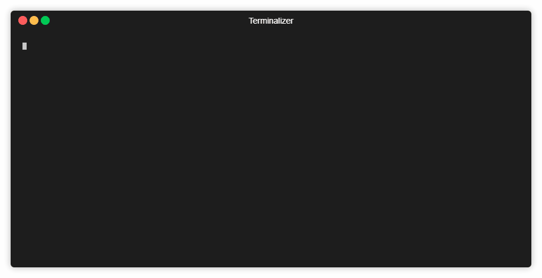

# Scrabble

Here is the demo [Website](https://scbl.herokuapp.com/). 

This Repo is for making Scrabble game. Please See these [PPT](https://drive.google.com/open?id=1_5sNTi9b4LrgvKK2xaYl-PBIJNzqiGW1) for understanding algorithm and working model.

## Running on console



## Getting Started( Main Logic)

These instructions will get you a copy of the project up and running on your local machine for development and testing purposes.

### Prerequisites

```
Python3
```

### Installing

first clone this git repository or download zip file.

```
git clone https://github.com/yatin2410/Scrabble.git
```


Installing dependancies

```
pip install dawg
```
```
pip install texttable
```

Now, go to folder

```
cd scrabble\MainLogic
```

starting script

```
python main.py
````

## Getting Started (WEBAPP)

These instructions will get you a copy of the project up and running on your local machine for development and testing purposes.

### Prerequisites

```
Python3, node and mongodb
```

### Installing

first clone this git repository or download zip file.

```
git clone https://github.com/yatin2410/Scrabble.git
```

Now, go to folder

```
cd scrabble\Web
```
Installing dependancies

```
pip install dawg
```
```
npm install 
```
now run using 
```
npm run server
````

## License

This project is licensed under the MIT License - see the [LICENSE](LICENSE) file for details
